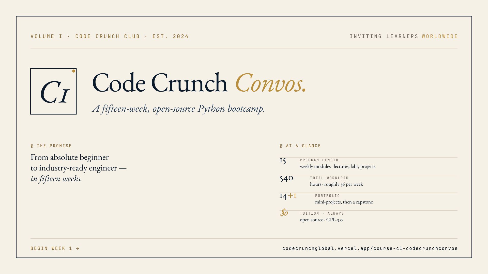

# C1 · Code Crunch Convos — Python Bootcamp



> A fully open-source, 15-week Python bootcamp designed for absolute beginners progressing toward industry-ready engineering skills.

[](LICENSE)
[](https://www.python.org/downloads/)
[](#open-source-philosophy)
[](CONTRIBUTING.md)

---

## Overview

**Code Crunch Convos (C1)** is the flagship Python program of the [Code Crunch Club](https://github.com/CODE-CRUNCH-CLUB) — a global, student-led learning community. This curriculum reorganizes C1 into a complete **15-week Python Bootcamp** that takes a learner from "I've never written code" to a portfolio-ready engineer who has shipped real projects, written tests, queried databases, consumed APIs, deployed a web app, and trained a basic ML model.

The program is delivered as a public, version-controlled repository — designed equally well for:

- **Self-study learners** working through the curriculum at their own pace.
- **Instructors and clubs** running it as a synchronous cohort.
- **Contributors** improving exercises, fixing bugs, or adding new modules.

---

## Mission & Goals

**Mission.** Make a high-quality, project-based Python education freely available to any learner, anywhere — built and improved in the open.

**Goals.**

1. Teach Python the way it's used in industry: with version control, testing, code review, and real tooling.
2. Build a portfolio of 15 mini-projects and one capstone — every artifact public on GitHub.
3. Reinforce **how to learn** (reading docs, writing tests, asking good questions) as much as **what to learn**.
4. Stay free, open, and remixable forever.

---

## Target Audience

- **Absolute beginners** with no prior programming experience.
- **Self-taught coders** wanting a structured path with accountability.
- **CS students** seeking practical, project-driven reinforcement of coursework.
- **Career-switchers** building a portfolio for technical interviews.
- **Educators and clubs** looking for ready-to-teach open curriculum.

No prerequisites beyond: a computer, a willingness to read documentation, and ~36 hours per week.

---

## Estimated Workload

Total program: **~540 hours over 15 weeks (≈36 hrs/week).**

Each week typically breaks down as:

| Component                 | Hours/week |
| ------------------------- | ---------- |
| Lectures / study material | 6          |
| Hands-on exercises        | 8          |
| Coding challenges         | 4          |
| Quizzes & readings        | 3          |
| Homework problems         | 6          |
| Mini-project              | 7          |
| Self-study / review       | 2          |
| **Total**                 | **~36**    |

Part-time learners can stretch the program to **30 weeks at ~18 hrs/week** without changing the content.

---

## Skills You'll Gain

By the end of Week 15, students will be able to:

- Write clean, idiomatic Python (PEP 8 / PEP 257).
- Use Git and GitHub for collaborative version control.
- Design data structures and pick the right one for the job.
- Build object-oriented systems with clear interfaces.
- Read and write files, handle exceptions, and parse structured data.
- Consume REST APIs and produce JSON.
- Build a small web application with Flask.
- Query relational databases with SQL and SQLAlchemy.
- Write unit and integration tests with `pytest`.
- Automate repetitive tasks with scripts.
- Analyze data with `pandas`, `NumPy`, and `matplotlib`.
- Train and evaluate a basic ML model with `scikit-learn`.
- Ship a full capstone project on GitHub with README, tests, and CI.

---

## Technologies & Tools

All free, open-source, and cross-platform.

| Category        | Tool                                                                                                        |
| --------------- | ----------------------------------------------------------------------------------------------------------- |
| Language        | [Python 3.11+](https://www.python.org/)                                                                     |
| Editor          | [VS Code](https://code.visualstudio.com/) (recommended) or any editor                                       |
| Notebooks       | [Jupyter](https://jupyter.org/)                                                                             |
| Version control | [Git](https://git-scm.com/) + [GitHub](https://github.com/)                                                 |
| Env management  | [venv](https://docs.python.org/3/library/venv.html) / [uv](https://github.com/astral-sh/uv)                 |
| Linting / format| [ruff](https://github.com/astral-sh/ruff), [black](https://black.readthedocs.io/)                           |
| Testing         | [pytest](https://docs.pytest.org/)                                                                          |
| Web             | [Flask](https://flask.palletsprojects.com/)                                                                 |
| Databases       | [SQLite](https://www.sqlite.org/), [SQLAlchemy](https://www.sqlalchemy.org/)                                |
| HTTP            | [requests](https://requests.readthedocs.io/), [httpx](https://www.python-httpx.org/)                        |
| Data            | [NumPy](https://numpy.org/), [pandas](https://pandas.pydata.org/), [matplotlib](https://matplotlib.org/)    |
| ML              | [scikit-learn](https://scikit-learn.org/)                                                                   |
| CI              | [GitHub Actions](https://docs.github.com/en/actions)                                                        |

See [resources/setup-guides/](resources/setup-guides/) for installation instructions on macOS, Windows, and Linux.

---

## How to Navigate This Repository

```text
C1-Code-Crunch-Convos/
├── README.md                  ← you are here
├── CONTRIBUTING.md            ← how to contribute
├── CODE_OF_CONDUCT.md         ← community rules
├── LICENSE                    ← GPL-3.0
├── curriculum/                ← the 15-week course
│   ├── SYLLABUS.md            ← full program overview
│   ├── week-01-python-foundations/
│   ├── week-02-data-types-operators/
│   ├── ...
│   └── week-15-capstone/
├── projects/
│   ├── mini-projects/         ← cross-week project specs
│   └── capstone/              ← capstone guide & rubric
├── resources/
│   ├── setup-guides/          ← install Python, Git, VS Code
│   ├── cheatsheets/           ← quick reference sheets
│   ├── git-github-workflow.md
│   └── coding-standards.md
├── community/
│   ├── support.md             ← where to ask for help
│   └── faqs.md
├── past-sessions/
│   └── SPRING-2025/           ← archived cohort materials
└── assets/                    ← shared images / diagrams
```

### Inside each `curriculum/week-XX-*/` you will find

```text
week-XX-topic/
├── README.md               ← objectives, schedule, navigation
├── lecture-notes/          ← written material to study
├── resources.md            ← curated readings + docs links
├── exercises/              ← guided, small practice problems
├── challenges/             ← harder, open-ended problems
├── quiz.md                 ← knowledge check
├── homework.md             ← graded practice
└── mini-project/           ← week-capping deliverable
```

---

## Weekly Curriculum

| Week | Topic                                                                            | Mini-project                     |
| ---- | -------------------------------------------------------------------------------- | -------------------------------- |
| 01   | [Python Foundations & Dev Environment](curriculum/week-01-python-foundations/)   | "Hello, You" personal greeter    |
| 02   | [Variables, Data Types & Operators](curriculum/week-02-data-types-operators/)    | Unit converter CLI               |
| 03   | [Control Flow — Conditionals & Loops](curriculum/week-03-control-flow/)          | Number-guessing game             |
| 04   | [Functions, Modules & Scope](curriculum/week-04-functions-modules/)              | Personal finance calculator      |
| 05   | [Data Structures & Comprehensions](curriculum/week-05-data-structures/)          | Contact book manager             |
| 06   | [File I/O & Exception Handling](curriculum/week-06-file-io-exceptions/)          | Log file analyzer                |
| 07   | [Object-Oriented Programming](curriculum/week-07-object-oriented-programming/)   | Library management system        |
| 08   | [APIs, JSON & HTTP](curriculum/week-08-apis-json/)                               | Weather dashboard CLI            |
| 09   | [Web Development with Flask](curriculum/week-09-web-development-flask/)          | Personal blog web app            |
| 10   | [Databases & SQL with Python](curriculum/week-10-databases-sql/)                 | Task tracker w/ SQLite           |
| 11   | [Testing, Debugging & Code Quality](curriculum/week-11-testing-debugging/)       | Tested utility library           |
| 12   | [Automation & Scripting](curriculum/week-12-automation-scripting/)               | File organizer bot               |
| 13   | [Data Analysis with pandas](curriculum/week-13-data-analysis/)                   | Real-world dataset analysis      |
| 14   | [Intro to AI/ML with scikit-learn](curriculum/week-14-intro-ai-ml/)              | Spam classifier                  |
| 15   | [Capstone Project](curriculum/week-15-capstone/)                                 | Your portfolio centerpiece       |

Full week-by-week syllabus: [curriculum/SYLLABUS.md](curriculum/SYLLABUS.md)

---

## Getting Started

1. **Install prerequisites** — Python 3.11+, Git, and VS Code. Follow the [setup guide for your OS](resources/setup-guides/).
2. **Fork & clone this repo.**

   ```bash
   git clone https://github.com/<your-username>/C1-Code-Crunch-Convos.git
   cd C1-Code-Crunch-Convos
   ```

3. **Create a virtual environment.**

   ```bash
   python -m venv .venv
   source .venv/bin/activate          # macOS/Linux
   .venv\Scripts\activate             # Windows
   ```

4. **Start with [Week 1](curriculum/week-01-python-foundations/).**
5. Submit your work via pull request to your personal fork, or share publicly on your GitHub profile.

---

## Contribution Guidelines

We welcome contributions from learners, instructors, and the wider community. See **[CONTRIBUTING.md](CONTRIBUTING.md)** for the full guide.

Quick links:
- 🐛 [Report a bug or typo](https://github.com/CODE-CRUNCH-CLUB/C1-Code-Crunch-Convos/issues/new)
- 💡 [Suggest an improvement](https://github.com/CODE-CRUNCH-CLUB/C1-Code-Crunch-Convos/issues/new)
- 🧑‍🏫 [Add or improve a lecture / exercise](CONTRIBUTING.md#contributing-curriculum)
- 🌐 [Translate a week into another language](CONTRIBUTING.md#translations)

All contributors agree to the [Code of Conduct](CODE_OF_CONDUCT.md).

---

## Open Source Philosophy

This curriculum is licensed under **[GPL-3.0](LICENSE)**. That means:

- Anyone may use, copy, modify, and redistribute this material — including for commercial teaching.
- Derivative works (forks, translations, modified curricula) must remain under GPL-3.0 and credit the original.
- We rely **only** on free and open-source tools. No paid platforms, no proprietary dependencies, no required SaaS.

We believe education should be unbounded by paywalls. Improvements come from learners who pass through it and give back — that's the loop we want to encourage.

---

## Community & Support

- 💬 **Discussions** — [GitHub Discussions](https://github.com/CODE-CRUNCH-CLUB/C1-Code-Crunch-Convos/discussions)
- 🐦 **Updates** — follow [@CODE-CRUNCH-CLUB](https://github.com/CODE-CRUNCH-CLUB) on GitHub
- 🆘 **Stuck on an exercise?** — see [community/support.md](community/support.md)
- ❓ **Frequently asked questions** — see [community/faqs.md](community/faqs.md)

---

## Past Sessions

Previous cohorts and their materials are preserved under [past-sessions/](past-sessions/) for historical reference:

- [SPRING 2025](past-sessions/SPRING-2025/) — original interview-prep focused 5-unit series

---

## License

This program is released under the **GNU General Public License v3.0** — see [LICENSE](LICENSE).

> "The best way to predict the future is to teach it."

— The Code Crunch Club
